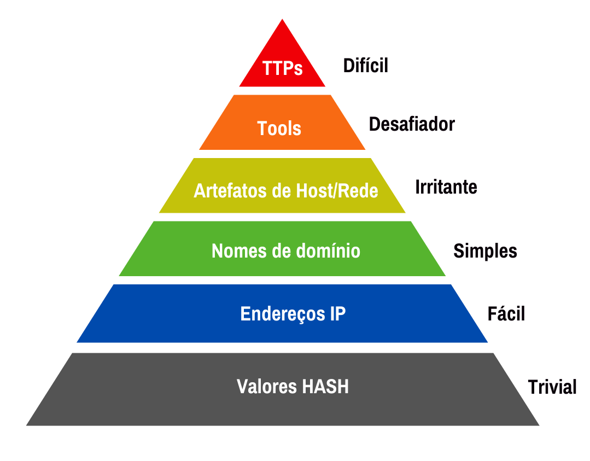

Objetivo: Registrar e Acompanhar os meus Estudos em Cybersecurity

    Este projeto visa acompanhar o meu aprendizado e documentar os meus avanços com o path SOC Level 1 da plataforma
    TryHackMe. Além disso, este repositório servirá para:

    Organizar o meu progresso e anotações.

    Demonstrar o meu nível de conhecimento e evolução na área.

Cyber Defence Frameworks
Pyramid of Pain

A Pirâmide da Dor é um modelo conceitual para o uso efetivo da Inteligência de Ameaças Cibernéticas em operações de
detecção de ameaças. O objetivo é causar "dor" ao atacante, entretanto nem todos os indicadores são iguais e possuem o
mesmo valor. Por isto, a pirâmide classifica os indicadores de trivial até tough com base na "dor" causada ao
adversário.
Hash Values (Trivial)

Quando identificamos um hash de um artefato malicioso utilizando, por exemplo, o VirusTotal, o atacante pode facilmente
adicionar uma string ao arquivo em segundos, modificando totalmente seu valor hash, o que faz com que não haja impacto
ou tenha um impacto trivial.
IP Address (Easy)

O IP é utilizado para identificar qualquer dispositivo conectado à rede, como computadores ou câmeras de segurança.
Quando se possui o IP de um atacante, a ação tomada é bloquear, derrubar ou negar o tráfego para dentro da rede
utilizando
firewalls. Entretanto, um adversário mais experiente consegue se livrar desse problema facilmente ao utilizar um novo
endereço de IP público.
Domain Names (Simple)

Nomes de domínio podem incluir domínios e subdomínios. Descobrir o domínio de um atacante causa um pouco mais de "dor",
pois é necessário comprar um novo domínio, registrá-lo e modificar os registros de DNS. Entretanto, muitos provedores de
DNS fornecem APIs, o que torna essa mudança mais simples.
Host Artifacts (Annoying)

Subindo mais na pirâmide, neste nível o atacante já sofre mais "dor": ele terá que gastar mais tempo e recursos para
mudar
seus métodos. Os artefatos do host são vestígios ou observáveis que os invasores deixam no sistema, como valores de
registro, execução de processos suspeitos, padrões de ataque, IOCs (Indicadores de Comprometimento), arquivos
descartados
por aplicativos maliciosos ou qualquer elemento exclusivo da ameaça atual.
Network Artifacts (Annoying)

Artefatos de rede causam mais dor. Isso significa que, se o ataque for detectado, o atacante precisará de mais tempo
para
reconfigurar suas táticas ou modificar as ferramentas, o que dá mais tempo para responder, detectar novas ameaças ou
remediar as existentes.

Um artefato de rede pode ser uma string de User-Agent, informações de C2 (Command and Control) ou padrões de URI
seguidos por solicitações HTTP POST. Um invasor pode usar uma string de User-Agent incomum ou não observada
anteriormente
no ambiente.
Tools (Challenging)

A camada de ferramentas inclui software e técnicas utilizadas por atacantes, como exploits, kits de exploração, malware
e outras ferramentas maliciosas. Ao detectá-las, o atacante precisa adquirir ou desenvolver novas ferramentas, o que
praticamente resulta em um "game over" para ele.
TTPs (Tough)

Se você detectar e responder aos TTPs (Táticas, Técnicas e Procedimentos) rapidamente, deixará os adversários quase sem
chance de revidar. Por exemplo, ao detectar um ataque Pass-the-Hash usando o Monitoramento de Log de Eventos do Windows
e corrigi-lo, é possível identificar o host comprometido rapidamente e interromper o movimento lateral na rede. Nesse
ponto, o atacante teria duas opções:

- Voltar, realizar mais pesquisas, treinamentos e reconfigurar suas ferramentas personalizadas;
- Desistir e procurar outro alvo.
